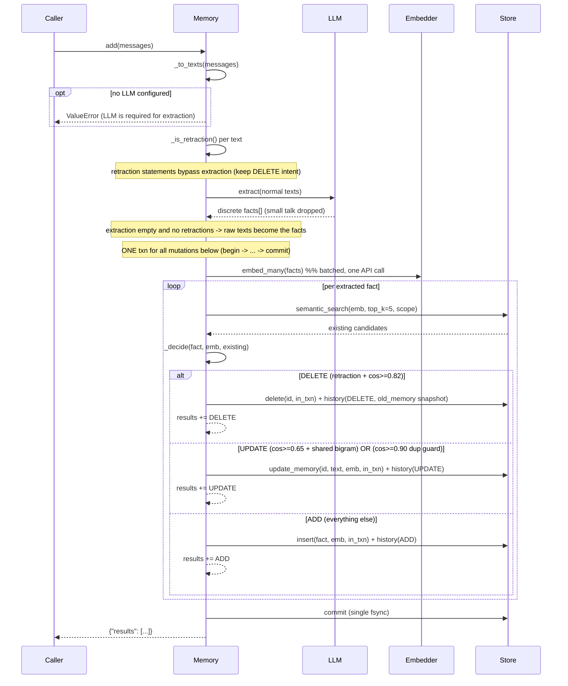
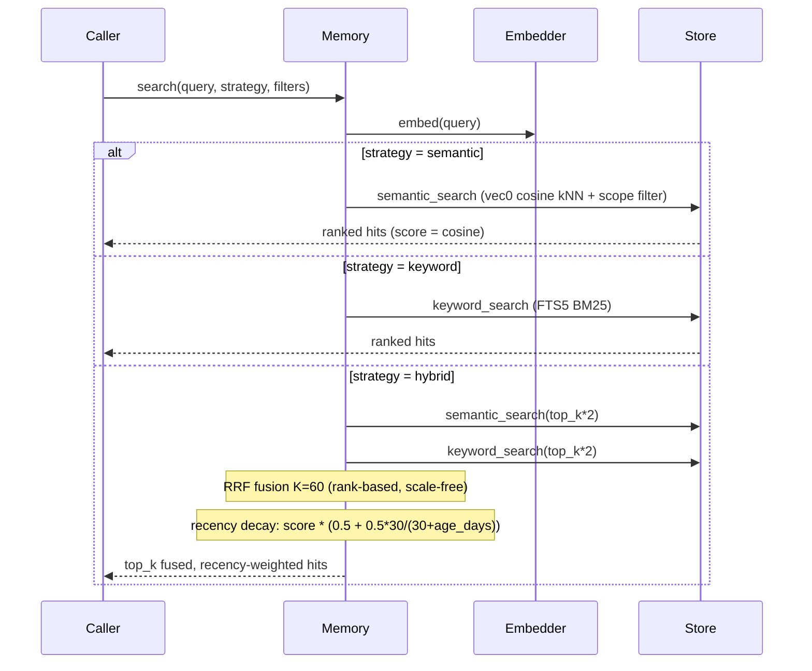
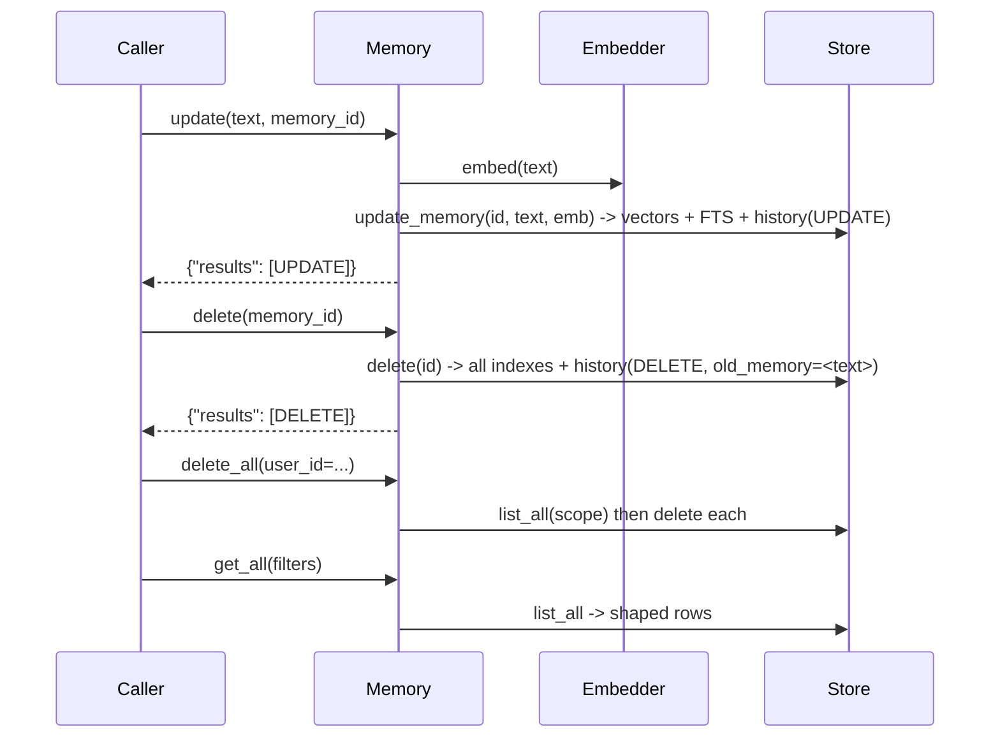
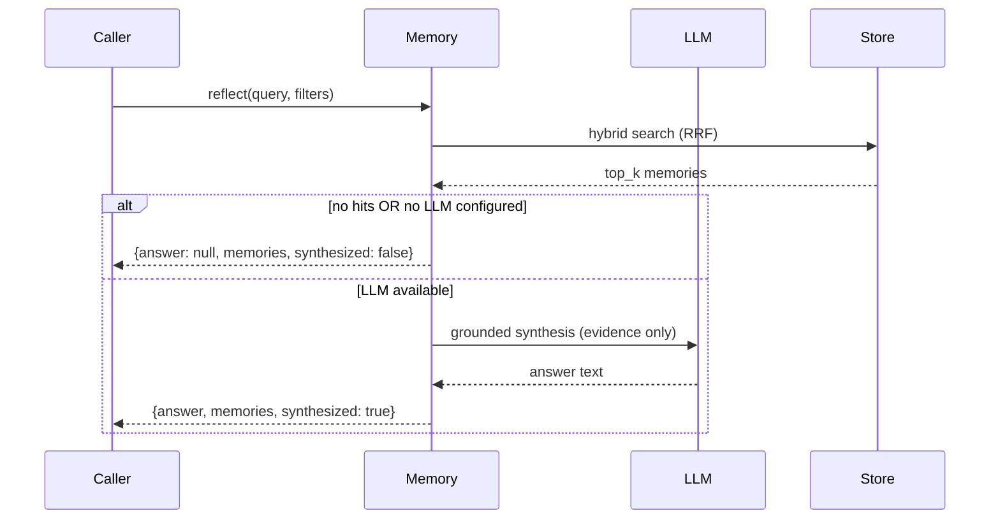
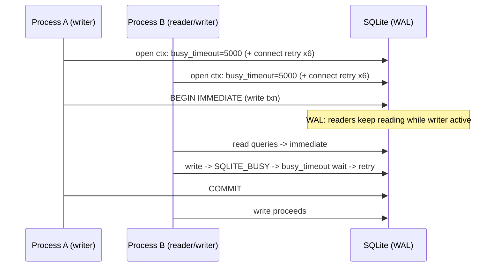

# MemLite — Flows

> Sequence diagrams for every operation. Render with
> `python docs/render_diagrams.py` (mermaid-cli, optional) or paste a block
> into any mermaid renderer.

## 1. add() — LLM extraction + deterministic reconcile (the only path)

> The former raw-add (no LLM) and LLM-reconcile variants were removed:
> exactly one add() path exists — LLM extraction + deterministic reconcile.

## 2. search — semantic / keyword / hybrid (RRF + recency)

## 3. update / delete / delete_all / get_all (admin surface)

## 4. reflect(query) — recall + synthesis

## 5. Concurrency / locking

