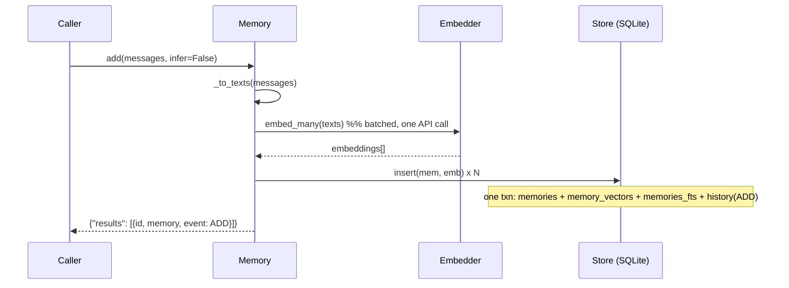
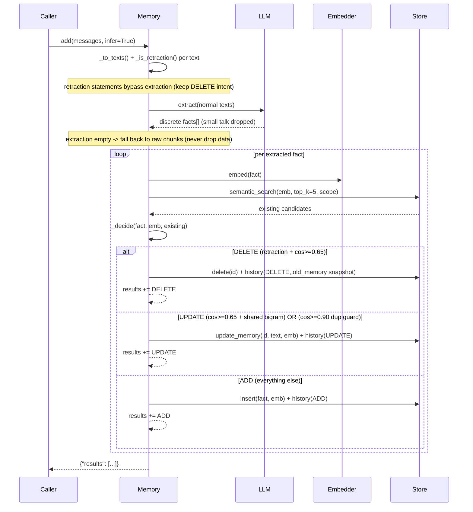
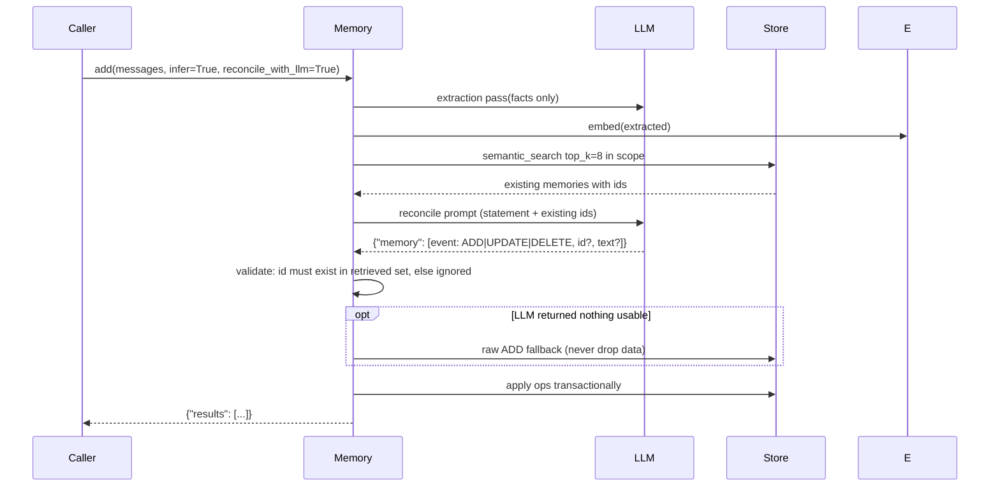
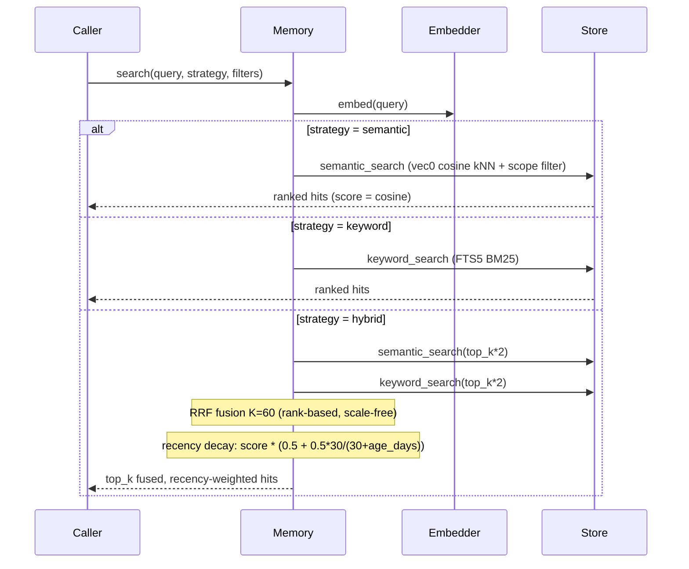
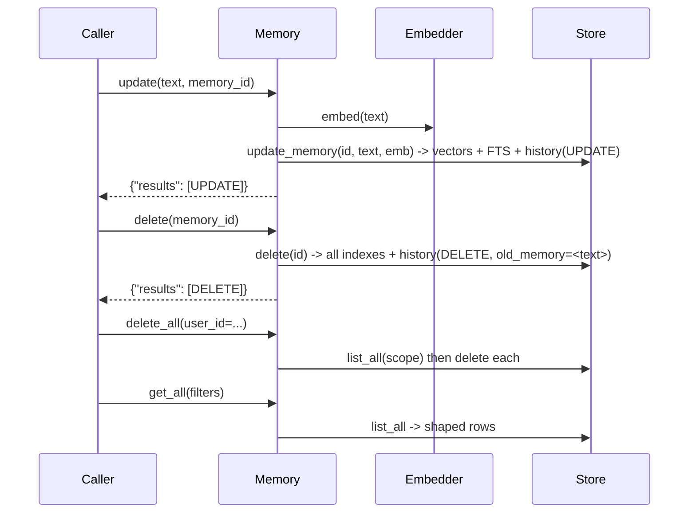
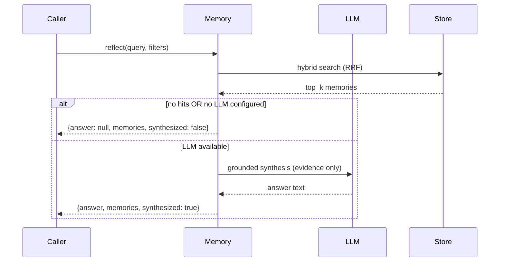
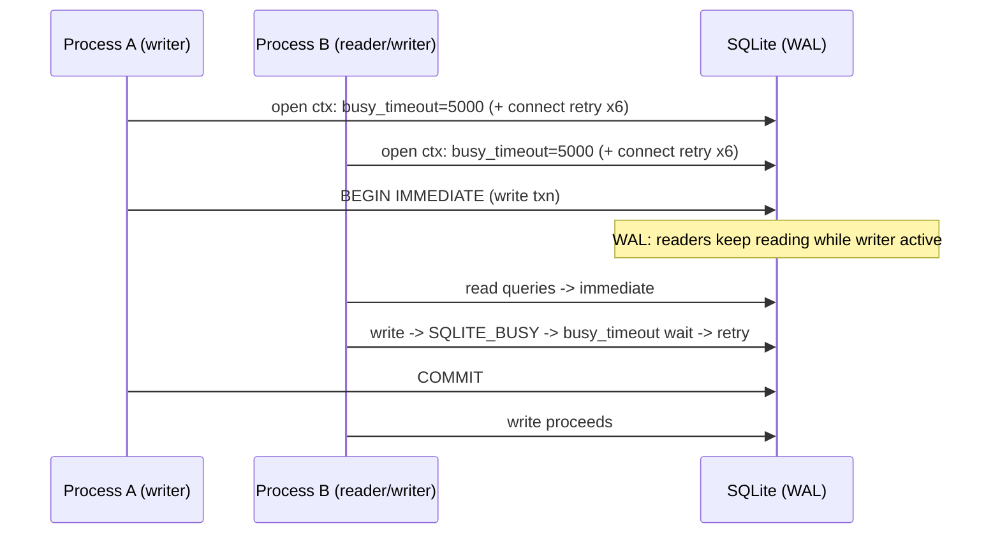

# MemLite — Flows

> Sequence diagrams for every operation. Render with
> `python docs/render_diagrams.py` (mermaid-cli, optional) or paste a block
> into any mermaid renderer.

## 1. add(infer=False) — Raw ADD

## 2. add(infer=True) — with LLM extraction + deterministic reconcile

## 3. add(infer=True, reconcile_with_llm=True) — LLM reconcile variant

## 4. search — semantic / keyword / hybrid (RRF + recency)

## 5. update / delete / delete_all / get_all (admin surface)

## 6. reflect(query) — recall + synthesis

## 7. Concurrency / locking

