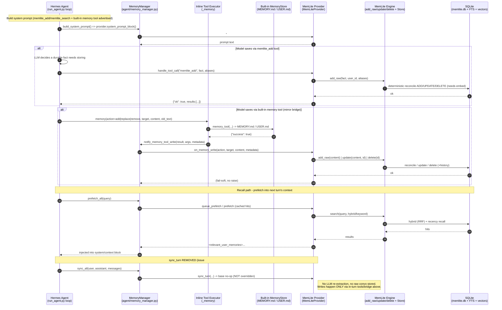

# MemLite × Hermes Agent — memory write path (current, post issue #1)

> **Status: CURRENT.** Reflects `sync_turn` REMOVED and the model-driven in-turn
> write path via `on_memory_write`. Read this before touching the Hermes provider
> (`hermes-plugin/__init__.py`) — the older `docs/sequence-all.md` predates the fix
> and still shows the removed background `sync_turn`.

## Why this changed (issue #1)

Hermes' `MemoryManager.sync_all()` used to call `provider.sync_turn(user, assistant,
messages)` after every turn. memlite's `sync_turn` fed the **entire user+assistant
transcript** to the LLM extraction pass (`_mem.add(convo)`). Two things broke:

1. **The default extractor has a tiny context.** `deepseek-ai/DeepSeek-V3` on
   DeepInfra reports a **512-token (~9216 char)** window. Real conversations far
   exceed it → the API throws 400 → `_extract()` returns `[]`.
2. **Raw fallback stored the transcript verbatim.** `core.py` did
   `if not extracted: treat raw text as the fact`, so assistant self-talk /
   working-notes were persisted as "durable" memory.

Fix: **removed** `sync_turn` (the provider now inherits the base no-op) and made
writes **model-driven in-turn** through `on_memory_write`.

## Live sequence — current implementation

## The two write paths (both live)

| Path | Trigger | Engine call | Notes |
|---|---|---|---|
| `memlite_add` tool | Model calls the tool directly | `add_raw(fact, user_id, aliases)` | Verbatim fact, still runs deterministic reconcile (dedup / near-dup UPDATE). |
| built-in `memory` tool → `on_memory_write` | Model calls `memory(add\|replace\|remove, ...)`; Hermes mirrors it | `add_raw()` \| `update(text, id)` \| `delete(id)` | `metadata.old_text` locates the target for replace/remove; `_find_by_text` is best-effort, fail-soft. |

`on_memory_write` contract (from Hermes' `MemoryManager.notify_memory_tool_write` →
`inline_tool_executors._memory`):
- `action`: `add` | `replace` | `remove`
- `target`: `memory` | `user` (stored as informational metadata; store is single-user)
- `content`: the fact text (empty for `remove`)
- `metadata`: `{old_text, session_id, tool_name, task_id, tool_call_id, write_origin}`
- Only fires on a **committed** built-in write (`{"success": true}`, not staged).

## What is gone

- `sync_turn` (background per-turn extraction) — **not overridden**; the base
  `MemoryProvider.sync_turn` is a concrete no-op, so `MemoryManager.sync_all()`
  calls a no-op. There is no automatic extraction of unsaid facts.

## Per-profile isolation (Hermes profiles)

Each Hermes profile has its own HERMES_HOME and so its own `memlite.db`, plus its
own copy of the plugin under `~/.hermes/profiles/<name>/plugins/memlite/` (and the
global `~/.hermes/plugins/memory/memlite/`, symlinked as `plugins/memlite`).
Keep all copies in sync with `hermes-plugin/__init__.py` when editing the provider.

## Revisit list (issue #1) — re-enabling background extraction later

- Point the extractor at a long-context model (`deepseek-ai/DeepSeek-V4-Flash`) or chunk input.
- Change the empty-extraction fallback to never store the raw assistant transcript.
- Sanitize FTS query escaping of `/` (paths like `NIFTY50.NS` break FTS).
- Guard the background thread against a closed store.
