# MemLite — Single UML Sequence Diagram (current flow)

> One diagram, all cases. Validated renders via mermaid.ink. Thresholds
> calibrated on live bge-base-en-v1.5 embeddings.

```mermaid
sequenceDiagram
    autonumber
    actor C as Caller / App
    participant HV as Hermes MemLiteProvider
    participant M as Memory (core.py)
    participant L as LLM (extraction only)
    participant E as Embedder (OpenAI-compatible, batched)
    participant S as Store (SQLite: memories + vec0 + FTS5 + history)
    participant P2 as Other Process

    %% ==================== HERMES LIFECYCLE (WRAPPER) ====================
    rect rgb(240,245,255)
    note over C,HV: Hermes lifecycle adapter (plugins/memory/memlite)
    C->>HV: prefetch()
    Note over HV: drain prefetch cache (0ms, no network)
    HV-->>C: <relevant_user_memories> (if cache non-empty)
    C->>HV: sync_turn(user_msg, assistant_msg)
    Note over HV: spawns daemon thread, non-blocking, primary context only
    HV->>M: add(messages) via worker thread (async, fire-and-forget)
    M-)HV: worker continues: speculative hybrid search
    Note over HV: worker fills _prefetch_cache for turn N+1
    Note over HV: circuit breaker: 5 consecutive failures -> 2 min backoff
    end

    %% ==================== WRITE: add() ====================
    rect rgb(235,244,255)
    note over C,S: add(messages) — the only write path.<br/>Caller is C when used as a standalone library, HV's worker thread when running under Hermes
    C->>M: add(messages)
    M->>M: _to_texts(messages) -> texts[]
    alt no LLM configured
        M-->>C: ValueError (LLM required for extraction)
    else extraction + deterministic reconcile
        M->>M: split texts: retractions (_is_retraction) vs normal
        M->>L: extract(normal texts)
        L-->>M: discrete durable facts (I/my -> User, filler dropped)
        alt extraction returned nothing AND no retractions
            Note over M: raw texts become the facts (never silently drop)
        end
        Note over M: retraction statements kept verbatim (DELETE intent preserved)

        %% Phase 1: planning — network I/O + reads, NO write lock held
        M->>E: embed_many(facts)   [one batched API call]
        E-->>M: embeddings[]
        loop per extracted fact
            M->>S: semantic_search(emb, top_k, scope filter)  [read-only]
            Note over S: adaptive widening: kNN scan x8 up to k=4096<br/>if scope filter discards everything
            S-->>M: existing candidates in scope
            M->>M: _decide(fact, emb, existing)
            alt DELETE: retraction intent AND cos >= 0.72
                Note over M: queue op: DELETE(id) + old_memory snapshot
            else UPDATE: (cos >= 0.65 AND shared content-bigram) OR cos >= 0.90
                Note over M: queue op: UPDATE(id, text, emb)
            else ADD: everything else (conservative default)
                Note over M: queue op: INSERT(text, emb)
            end
        end

        %% Phase 2: mutation — atomic write transaction, minimal lock hold
        M->>S: BEGIN IMMEDIATE
        M->>S: apply queued mutations (memories + vec0 + FTS5 + history)
        M->>S: COMMIT (single fsync)
        M-->>C: {results: [{id, memory, event}]}
    end
    end

    %% ==================== READ: search() ====================
    rect rgb(240,255,240)
    note over C,E: search(query, strategy, filters) — no LLM needed
    C->>M: search(query, strategy, filters)
    M->>E: embed(query)
    E-->>M: query_emb
    alt strategy semantic (default)
        M->>S: vec0 cosine kNN + scope join/filter
        S-->>M: raw rows
        Note over M: _shape: score = 1 - cosine distance
        M-->>C: scored hits
    else strategy keyword
        M->>S: FTS5 MATCH (BM25)
        S-->>M: raw rows
        Note over M: _shape: score = 1/(1+abs(rank))
        M-->>C: shaped hits
    else strategy hybrid
        M->>S: semantic_search(query_emb, top_k*2)
        M->>S: keyword_search(query, top_k*2)
        S-->>M: both raw lists
        Note over M: RRF fuse K=60: score = Σ 1/(60+rank) over both lists
        Note over M: recency: score *= 0.5 + 0.5*30/(30+age_days) — newer wins ties
        M-->>C: top_k fused, recency-weighted
    end
    end

    %% ==================== SYNTHESIS: reflect() ====================
    rect rgb(255,250,235)
    note over C,L: reflect(query), needs LLM, never blocks recall
    C->>M: reflect(query, filters)
    M->>E: embed(query)
    E-->>M: query_emb
    M->>S: hybrid search (RRF)
    S-->>M: memories
    alt no hits OR LLM call fails
        M-->>C: {answer: null, memories, synthesized: false}
    else LLM available
        M->>L: grounded synthesis (evidence only)
        L-->>M: answer
        M-->>C: {answer, memories, synthesized: true}
    end
    end

    %% ==================== ADMIN UPDATE/DELETE (direct) ====================
    rect rgb(246,240,255)
    note over C,S: update / delete / delete_all / get_all — no LLM needed
    opt update(text, memory_id)
        C->>M: update()
        M->>E: embed(text)
        E-->>M: emb
        M->>S: update row + vector + FTS + history[UPDATE], then commit
        M-->>C: {results: [UPDATE]}
    end
    opt delete(memory_id)
        C->>M: delete()
        M->>S: delete from memories + vectors + FTS + history[DELETE, old_memory], then commit
        M-->>C: {results: [DELETE]}
    end
    opt delete_all(scope)
        C->>M: delete_all()
        M->>S: BEGIN IMMEDIATE, delete each (in_txn), then COMMIT (single fsync batch)
        M-->>C: {results: [DELETE...]}
    end
    opt get_all(filters)
        C->>M: get_all()
        M->>S: list_all (scope + memory_type)
        M-->>C: {results: [...]}
    end
    end

    %% ==================== CONCURRENCY ====================
    rect rgb(255,240,240)
    note over S,P2: multi-process access
    P2->>S: connect (busy_timeout=5000 + retry x6 + synchronous=NORMAL)
    alt P2 writes while S holds write lock
        P2-->>S: SQLITE_BUSY -> busy_timeout wait -> proceeds after COMMIT
    else P2 reads while S writes
        Note over P2: WAL: readers never blocked
    end
    end
```

### Decision thresholds (calibrated on live bge-base-en-v1.5 embeddings)

| Signal | Range | Gate |
|---|---|---|
| Unrelated facts | cosine 0.38–0.52 | ADD |
| Mild topical overlap | 0.65–0.70 | ADD (even w/ retraction intent) |
| Same entity, different fact | ~0.76 | ADD (different-fact rule) |
| Retraction vs its target fact | 0.769+ | DELETE (requires explicit "Forget X" regex first) |
| Topic change w/ bigram residue | ~0.73 | UPDATE |
| Reworded duplicate | ≥ 0.90 | UPDATE in place |

Safety asymmetry: a wrong ADD is a duplicate; a wrong UPDATE/DELETE loses
data — thresholds are tuned to fail toward ADD.

### Failure semantics

| Failure | Behavior |
|---|---|
| No LLM configured | `add()` raises ValueError; read/admin paths work fine |
| Extraction returns empty + no retractions | raw texts stored as the facts |
| Any mutation in the reconcile loop fails | whole transaction rolls back — no partial writes |
| db locked by another process | busy_timeout=5000 wait, then connect retry ×6 |
| reflect LLM fails | returns raw memories (`synthesized: false`), recall unaffected |
| Background sync fails 5x | circuit breaker: 2 min backoff, turns never block |
