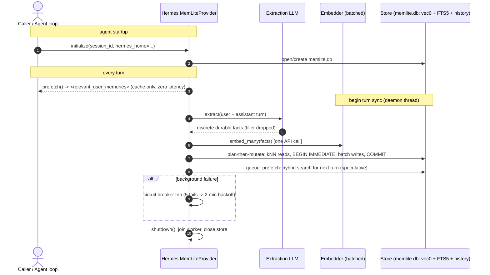

# MemLite — Hermes Memory Provider (lifecycle)



### Activation

```bash
hermes config set memory.provider memlite
```

Hooks used: `prefetch` (before each API call), `sync_turn` (after each turn),
`queue_prefetch` (next-turn pre-warm), `on_session_end`. Tools registered:
`memlite_search`, `memlite_add`, `memlite_forget`.
